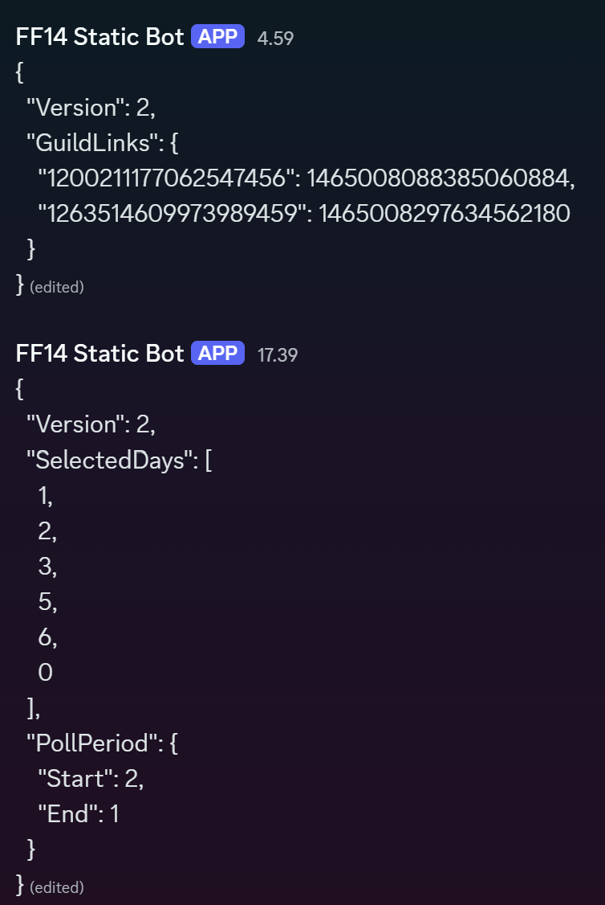

# Discord Schedule Bot

Created using **NetCord**. Easily create polls for your game group!<br>
I created this bot to help with managing our groups scheduling, since manually creating discord polls was getting tiring. <br>
You can easily manage the start/end dates for each poll and even manually select the days you want to be polled if some days are never going to work out for your group.

## Features

- **/interface**  
  Sends a menu message with all available commands as buttons.

- **/cleanup**  
  Cleans up all the bot messages from the last 50 overall messages.

- **/dayselect**  
  Selects days that will be added to polls.
 
- **/pollperiod**   
  Select the start and end dates for your polls (also adds to selected days if missing)

- **/thisweek**  
  Tries to create a poll with valid days for this week using the selected days.

- **/nextweek**  
  Creates a poll with valid days for the next week using the selected days.

## Branches
### **Main**  
Really cursed hacky way of making a personal Discord server a database. 
<br>The bot holds all the data in a dedicated channel. <br>
requires envs: 
- MESSAGE_ID 
  (the id of the message which holds the GuildRegistry JSON) 
- CHANNEL_ID 
  (the channel where the bot sends all of the data)

On startup, the bot reads the registry and fills it with uninitialized servers. When saving server settings it modifies the corresponding messageId from the registry.<br>
This currently needs some manual tuning to setup. You have to make the bot send a message first to a channel and use that messageId as the registry. <br>
All in all, this was just a really funny way of persisting server settings through VPS rebuilds. Below is an image of the channel where it stores the data.
<br>

### Heroku-Postgres
This branch was made using Heroku-Postgres. Below is the only table needed.
```
CREATE TABLE guild_settings (
    guild_id BIGINT PRIMARY KEY,
    selected_days INT[],
    poll_start_day INT,
    poll_end_day INT,
    version INT
);
```
### JSON
This was the original implementation, it saves the configurations to a local data.json file.